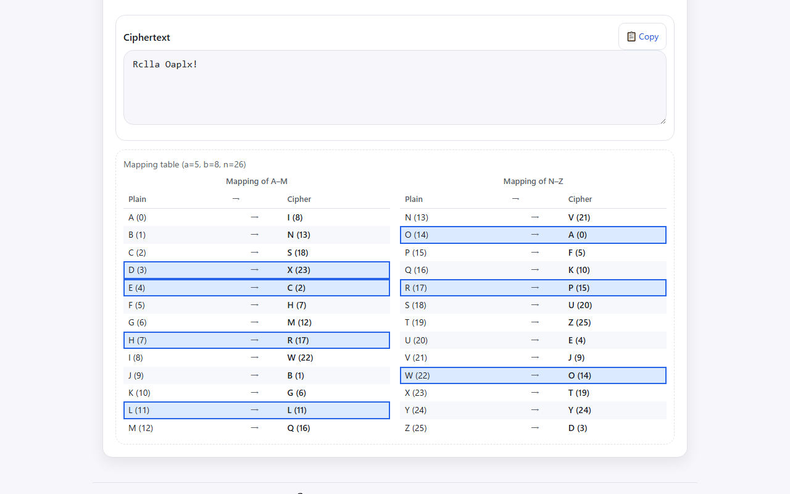
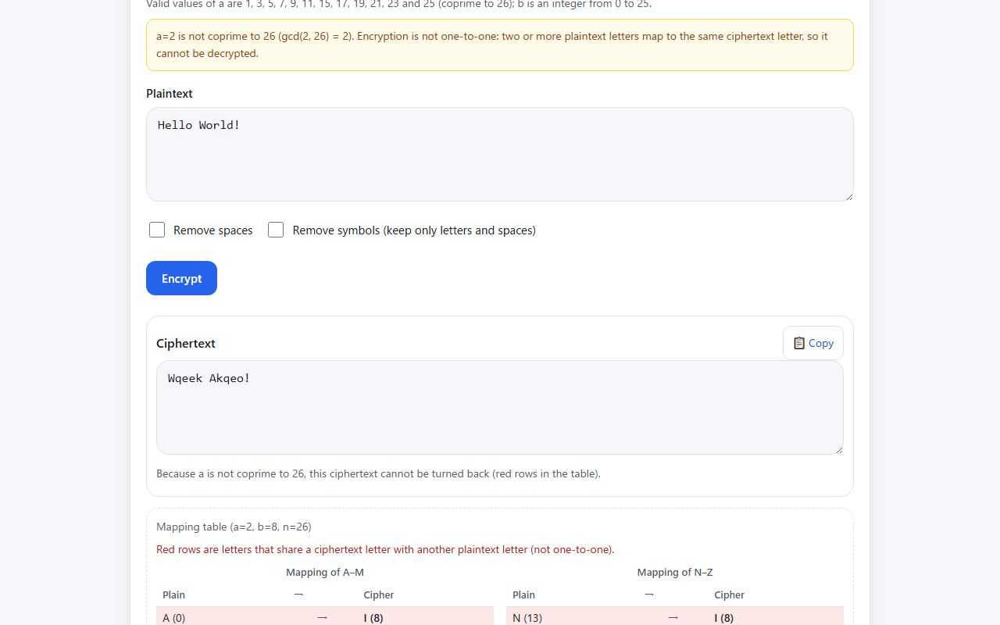
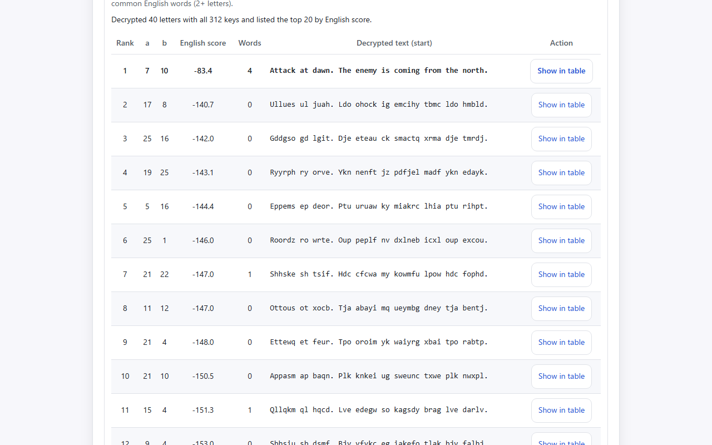
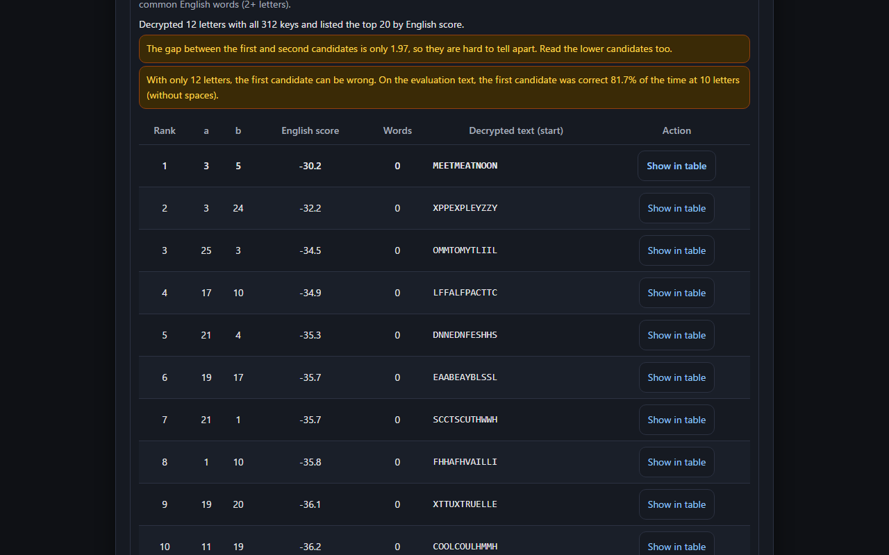
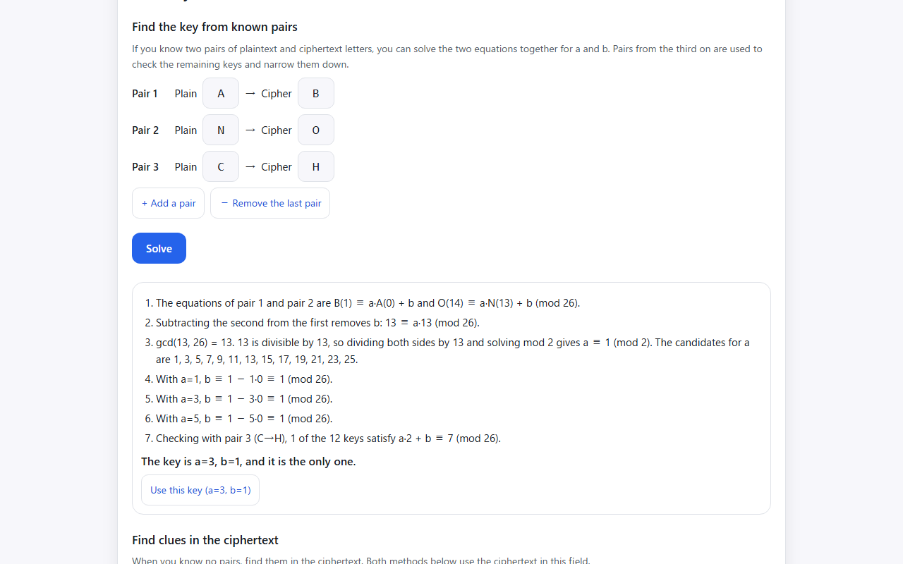
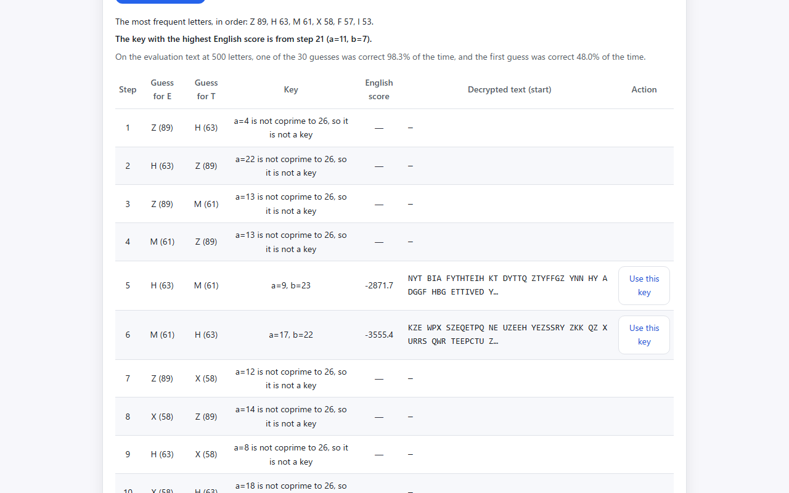
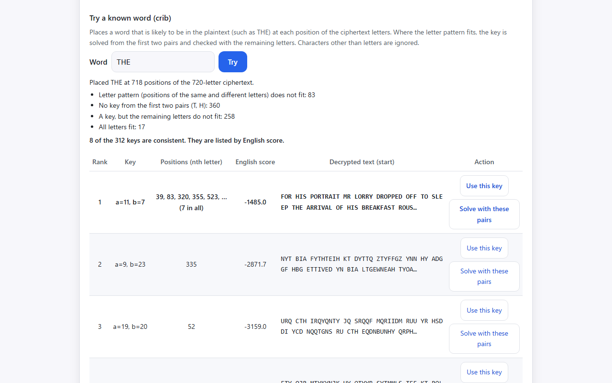
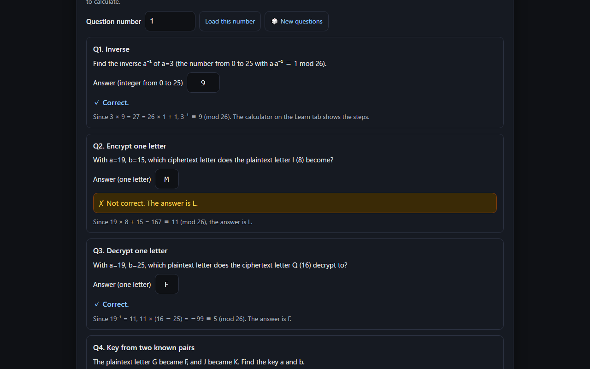

English · [日本語](README.md)

# Affine CipherLab - Affine Cipher Learning Tool


[](https://ipusiron.github.io/affine-cipherlab/)

**Day049 - 100 Security Tools with Generative AI**

Affine CipherLab is a web tool for learning and trying the affine cipher, a classical cipher. Besides encryption and decryption, it lets you follow the letter mapping in a table and try a brute-force attack over all 312 keys. The brute-force score combines how English adjacent letter pairs look with matches of common English words, and the README lists how often the first candidate is correct for each text length.

The tool has six tabs.

1. Encrypt: encrypts the plaintext and highlights the letters used in the mapping table
2. Decrypt: turns the ciphertext back with the inverse
3. Brute force: tries all 312 keys and ranks the candidates by how English they look
4. Solve by hand: shows the steps to solve the key from known pairs (narrowing it down from the third pair on), trying a known word (crib), and guesses of E and T from the most frequent letters
5. Learn: explains the formulas, finding the inverse (with a calculator), special cases and how the brute-force attack works
6. Practice: gives the same five questions for each question number and shows worked explanations when you check the answers

---

## 🌐 Demo

👉 **[https://ipusiron.github.io/affine-cipherlab/](https://ipusiron.github.io/affine-cipherlab/)**

Try it directly in your browser.

---

## 📸 Screenshots

>
>
>*Hello World! encrypted with a=5, b=8; the rows of the letters used are highlighted*

>
>
>*With a=2 (not coprime to 26), two plaintext letters map to the same ciphertext letter, so it cannot be decrypted*

>
>
>*An English ciphertext tried with all 312 keys; the candidate with a=7, b=10 comes first*

>
>
>*A 12-letter ciphertext; the tool says the first two candidates are close and the text is short (dark)*

>
>
>*Two pairs with difference 13 (A→B, N→O) leave 12 keys, and a third pair (C→H) settles a=3, b=1*

>
>
>*30 guesses of E and T for a 900-letter ciphertext; the key from step 21 has the highest English score*

>
>
>*THE placed on the same ciphertext (720 letters) narrows the 312 keys to 8; the first, a=11, b=7, fits at 7 positions*

>
>
>*Checking the answers for question number 1, with whether each is correct and a worked explanation (dark)*

---

## ✨ Features

### 🔐 Encrypt

- Enter a and b and encrypt the plaintext. Only letters (A–Z, a–z) are converted, and upper and lower case are kept
- Characters other than letters (digits, symbols, Japanese and so on) are kept as they are; curly quotes and full-width symbols are accepted. Full-width letters are not converted, and the tool suggests changing them to half-width letters
- The mapping table (two columns, A–M and N–Z) highlights the rows of the letters used. While typing, the row of the last letter flashes
- If a is not coprime to 26, the tool warns, still encrypts, and shows that the result cannot be turned back, with the rows that share a ciphertext letter in red
- Remove spaces, remove symbols (keep only letters and spaces), and copy the ciphertext
- Buttons put in the keys of special cases (Caesar, ROT13, Atbash, multiplicative cipher)

### 🔓 Decrypt

- Finds the inverse a⁻¹ with the extended Euclidean algorithm and decrypts
- If a is not coprime to 26, not an integer or out of range, the tool says why and disables the decrypt button
- A button fills in the ciphertext and key from the Encrypt tab. a and b stay the same on the Encrypt and Decrypt tabs

### 🔍 Brute force

- Decrypts with all 312 keys (12 choices of a × 26 of b) and lists the top 20 by English score
- The English score is the sum of log-likelihoods of adjacent letter pairs plus 4 × the number of common English words (see the section below for the method and accuracy)
- If the gap between the first and second candidates is under 3, the tool says they are hard to tell apart. For texts under 20 letters, it adds the accuracy measured on the evaluation text for that length
- Scoring uses the first 2,000 letters, so long ciphertexts finish without waiting
- "Show in table" on a candidate puts its key into a and b
- A link passes the ciphertext to Frequency Analyzer (Day009) with `#text=`

### ✍️ Solve by hand

- Solves the key from 2 to 6 known pairs (plaintext→ciphertext letters). The first two pairs show the steps: subtracting the equations, the inverse (or candidates from the gcd), then b; pairs from the third on check the remaining keys and narrow them down
- Explains why when several keys remain (difference 13), there is no solution, an a is not a key, pairs contradict each other, or no key satisfies a pair
- Places a known word (crib) at each position of the ciphertext and keeps only the consistent keys. It shows how the positions were judged, and "Solve with these pairs" puts the pairs at that position into the fields above to show the steps
- Lists 30 guesses of E and T from the most frequent ciphertext letters and highlights the key with the highest English score

### 📚 Learn

- The definition, why a must be coprime to 26, finding the inverse (a=5), special cases (Caesar, ROT13, multiplicative cipher, Atbash), how the brute-force attack works, and related tools
- Inverse calculator: choose a to see the rows of the extended Euclidean algorithm (remainder, quotient, coefficients) and a⁻¹, or that there is no inverse when a is not coprime to 26

### 🎓 Practice

- Gives the same five questions for each question number (inverse, encrypting one letter, decrypting one letter, the key from two known pairs, the key from a short ciphertext). Sharing the number lets everyone in a class solve the same questions
- Checking the answers shows whether each is correct, with a worked explanation

### 🌐 Interface

- Japanese and English (`?lang=ja`, `?lang=en`; the choice is saved), light and dark themes (also follows the OS setting)
- Tabs can also be moved with the arrow keys, Home and End. Warnings and results are announced to screen readers (aria-live)
- Works when index.html is opened directly as a file (built with plain scripts)
- Receives a ciphertext in the URL with `#text=` and opens it on the Brute force tab (see below)

---

## 📖 Usage

1. Enter a and b on the Encrypt tab (valid values of a are 1, 3, 5, 7, 9, 11, 15, 17, 19, 21, 23 and 25; b is 0 to 25)
2. Enter the plaintext, press Encrypt and check the letter mapping in the table
3. On the Decrypt tab, press "Use the ciphertext and key from the Encrypt tab", then Decrypt to see it turn back
4. Paste a ciphertext on the Brute force tab and press Analyze to see the candidates. "Show in table" puts a candidate's key in
5. On the Solve by hand tab, solve the key from known pairs. Without pairs, try a word likely to be in the plaintext (such as THE), or look for the key in the table of E and T guesses
6. Use the calculator on the Learn tab to see how the inverse is found
7. Solve the questions on the Practice tab and check the steps when you check the answers

---

## 🧮 Mathematical background

### Definition

Letters are turned into numbers A=0, B=1, …, Z=25 and converted as follows.

```
Encrypt: Enc(m) = (a × m + b) mod 26
Decrypt: Dec(c) = a⁻¹ × (c − b) mod 26
```

- `m` is a plaintext letter and `c` a ciphertext letter (numbers 0 to 25)
- `a` is the multiplicative key and `b` the additive key (0 to 25)
- `a⁻¹` is the inverse of a (the number with a⁻¹ × a ≡ 1 (mod 26))

### Why a must be coprime to 26

When gcd(a, 26) = 1, the inverse a⁻¹ exists, the text can be decrypted, and different plaintext letters always become different ciphertext letters (one-to-one). When gcd(a, 26) > 1, there is no inverse, several plaintext letters map to the same ciphertext letter, and the original letter cannot be recovered. With a=2, for example, A (0) and N (13) map to the same letter (2 × 13 = 26 ≡ 0).

There are 12 values of a coprime to 26. Their inverses are as follows.

| a | 1 | 3 | 5 | 7 | 9 | 11 | 15 | 17 | 19 | 21 | 23 | 25 |
|---|---|---|---|---|---|---|---|---|---|---|---|---|
| a⁻¹ | 1 | 9 | 21 | 15 | 3 | 19 | 7 | 23 | 11 | 5 | 17 | 25 |

### Finding the inverse

The extended Euclidean algorithm finds t such that 26 × s + a × t = 1. For a=5, 26 = 5 × 5 + 1, so 1 = 26 × 1 + 5 × (−5) and a⁻¹ ≡ −5 ≡ 21 (5 × 21 = 105 = 26 × 4 + 1).

---

## 💡 Intuition

- `b` shifts the letters
- `a` stretches and wraps them (around the remainder modulo 26)
- `a=1` is a shift cipher, and `a=1, b=3` is the Caesar cipher

---

## 🔗 Related classical ciphers

### Shift, Caesar, Atbash and multiplicative ciphers

- The shift cipher is the special case a=1 (Enc(m) ≡ m + b (mod 26)). The Caesar cipher is b=3 and ROT13 is b=13
- The multiplicative cipher is the special case b=0 (multiplication only)
- Atbash (A↔Z, B↔Y) is the special case a=25, b=25. Since 25 ≡ −1, Enc(m) = 25 − m

### Polyalphabetic affine cipher

This tool handles the monoalphabetic affine cipher (the same a and b for every letter). Changing a and b by position gives a polyalphabetic affine cipher.

```
Position 1: Enc₁(m) = (a₁ × m + b₁) mod 26
Position 2: Enc₂(m) = (a₂ × m + b₂) mod 26
...
Position k: Encₖ(m) = (aₖ × m + bₖ) mod 26
```

- The k keys are used in turn, back to the first at letter k+1 (period k)
- The same plaintext letter becomes different letters by position, so it resists frequency analysis better than the monoalphabetic cipher
- There are 312ᵏ keys

### Relation to the Vigenère cipher

The Vigenère cipher changes only the shift (b) by position, which is a polyalphabetic affine cipher with a fixed at 1.

### Classification

- Monoalphabetic substitution: Caesar cipher, Atbash, monoalphabetic affine cipher
- Polyalphabetic substitution: Vigenère cipher, polyalphabetic affine cipher
- Polygraphic substitution (two letters at a time): Playfair cipher
- Transposition: rail fence cipher, columnar transposition

---

## 📝 Examples

These are the outputs of the same calculation as the tool (the values in the README are checked against the implementation by tests).

| Plaintext | a | b | Ciphertext | Note |
|---|---|---|---|---|
| HELLO | 5 | 8 | RCLLA | a⁻¹ = 21 |
| Hello World! | 5 | 8 | Rclla Oaplx! | case and symbols are kept |
| CRYPTOGRAPHY | 5 | 8 | SPYFZAMPIFRY | |
| Mixed-Case Text | 5 | 8 | Qwtcx-Siuc Zctz | |
| HELLO | 1 | 3 | KHOOR | Caesar cipher |
| HELLO | 1 | 13 | URYYB | ROT13 |
| HELLO | 25 | 25 | SVOOL | Atbash |
| HELLO | 3 | 0 | VMHHQ | multiplicative cipher |

---

## 🔬 How the brute-force attack works and how accurate it is

1. Decrypt the ciphertext with all 312 keys (scoring uses the first 2,000 letters)
2. Score how English each result looks: the sum of log-likelihoods of adjacent letter pairs (a table built from about 160,000 letters of Pride and Prejudice), plus 4 × the number of common English words (2+ letters, 275 words)
3. Rank by score. If the gap between the first and second candidates is under 3, the tool says they are hard to tell apart

The word weight (×4) and the gap threshold (3) were chosen on the training text (Pride and Prejudice). On the training text, the first candidate was correct 99.3% of the time when the gap was 3 or more, and 56.2% when it was under 3.

The table below shows how often the first candidate turned back into the original plaintext, for plaintexts cut from the evaluation text (A Tale of Two Cities, a different book from the training text) and encrypted with keys chosen by a seeded random generator (300 trials each).

| Letters | With word spaces | Without spaces |
|---|---|---|
| 6 | 67.0% | 46.0% |
| 8 | 81.0% | 68.3% |
| 10 | 88.7% | 81.7% |
| 15 | 98.3% | 95.3% |
| 20 | 100.0% | 98.3% |
| 30 | 100.0% | 100.0% |

- Without spaces, words cannot be matched, so only adjacent letter pairs decide
- Up to about 10 letters, the first candidate can be wrong. Read the top candidates to check
- `node tools/evaluate.mjs eval` reproduces the table

---

## ✍️ Solve by hand (known pairs, cribs and frequency guesses)

### Find the key from two known letters

With two pairs of plaintext and ciphertext letters (p1→c1, p2→c2), subtract the two equations c1 ≡ a·p1 + b and c2 ≡ a·p2 + b to remove b, and solve c1 − c2 ≡ a·(p1 − p2) (mod 26) for a.

- If the plaintext difference (p1 − p2) is coprime to 26, multiplying by its inverse gives a single a. For E→C and T→Z, the inverse 19 of the difference 11 gives a ≡ 3 × 19 ≡ 5 and b ≡ 2 − 5 × 4 ≡ 8
- If the difference is even (gcd 2), there are two candidates for a, and only the one coprime to 26 is a key
- If the difference is 13, there are 13 candidates for a. For A→B and N→O, all 12 values of a coprime to 26 are keys, so these two pairs are not enough
- Pairs where the same plaintext letter becomes two different ciphertext letters, or where no candidate for a is coprime to 26, cannot happen with an affine cipher

### Narrow down with a third pair or more

When two pairs do not settle the key (difference 13), or to check that the pairs are right, add pairs from the third on. Of the keys solved from the first two pairs, only those satisfying a·p + b ≡ c (mod 26) remain.

- A→B and N→O leave 12 keys (all with b=1). Adding C→H leaves only the key with 2a + 1 ≡ 7, so the key is a=3 and b=1
- If no key satisfies some pair, it cannot happen with an affine cipher (the input is wrong, or it is a different cipher)
- Up to six pairs can be entered. A repeated pair counts once

### Try a known word (crib)

If you know a word likely to be in the plaintext (a crib), you can narrow down the key while looking for where it is in the ciphertext. The tool places the word at each position of the ciphertext letters and checks the following in order.

1. Letter pattern: the affine cipher replaces letters one-to-one, so positions with the same letter in the word have the same letter in the ciphertext, and positions with different letters have different letters (for THAT, the first and fourth letters are the same)
2. Solve the key as above from two pairs: the first letter of the word and the first letter that differs from it
3. Check the remaining letters with that key

Only keys from positions where all letters fit remain, ranked by the English score of the decrypted text. The table shows the results of trying THE and THAT on the evaluation text encrypted without spaces (300 trials each). The number of keys left is the average when the plaintext contains the word.

| Letters (no spaces) | Contains THE | Keys left by THE | Contains THAT | Keys left by THAT |
|---|---|---|---|---|
| 50 | 66.3% | 1.71 | 17.3% | 1.04 |
| 100 | 86.7% | 2.51 | 31.7% | 1.13 |
| 200 | 98.3% | 3.78 | 43.7% | 1.28 |
| 500 | 100.0% | 7.25 | 80.7% | 1.60 |

- When the plaintext contains the word, the 312 keys narrow down to a few, and the first by English score was correct at every length
- When the plaintext does not contain the word, the correct key does not remain. Only 43.7% of the 200-letter texts contained THAT
- The longer the ciphertext, the more positions fit by chance and the more keys remain. A word with a repeated letter (THAT) adds a letter-pattern condition, so it narrows down to almost one key
- `node tools/evaluate.mjs crib` reproduces the table

### Guess E and T from the most frequent letters

E and T are especially common in English, so guessing that the most frequent ciphertext letters are E and T lets you solve the key as above. The difference between E and T is 11, which is coprime to 26, so each guess gives exactly one a (if a is even or 13, the guess is wrong). The tool lists 30 guesses from the six most frequent letters, each with the English score of the text its key gives.

The table shows, for the evaluation text (A Tale of Two Cities) encrypted with keys chosen by a seeded random generator, how often the first guess (most frequent as E, second as T) was correct and how often one of the 30 guesses was correct (300 trials each). Whenever the correct key was among the 30 guesses, the key with the highest English score was the correct one.

| Letters | First guess correct | One of 30 correct |
|---|---|---|
| 50 | 13.3% | 68.7% |
| 100 | 19.3% | 76.0% |
| 200 | 27.7% | 90.3% |
| 500 | 48.0% | 98.3% |
| 1000 | 58.3% | 99.0% |

- T is not always the second most frequent letter (A and O are common too), so the first guess is often wrong
- For short ciphertexts the brute-force attack is more reliable. Frequency guesses are for learning how to solve by hand
- `node tools/evaluate.mjs freq` reproduces the table

---

## 🎓 Practice

The Practice tab gives the same five questions for each question number (1 to 999999). The questions are made with a random generator determined by the number, so the same number gives the same questions in any browser. A new number is chosen each time the page is opened, and "Load this number" loads a number you enter.

| Q | Content | Answer |
|---|---|---|
| 1 | The inverse a⁻¹ of a | An integer from 0 to 25 |
| 2 | Encrypting one letter | One letter |
| 3 | Decrypting one letter | One letter |
| 4 | The key from two known pairs (their difference is coprime to 26, so the key is unique) | a and b |
| 5 | The key from a short ciphertext | a and b |

- Checking the answers shows whether each is correct, with a worked explanation. You may use the other tabs to calculate
- a=1 and a=25 are not used, because they give no practice in calculating by hand
- The ciphertext of Q5 is chosen from 26 English proverbs and sample sentences. Tests confirm that each one comes back as the first brute-force candidate, with a gap of 3 or more to the second
- Example: Q5 of question number 1 is `QB QVLT NT RBBK QVLT` (a=11, b=3; the plaintext is NO NEWS IS GOOD NEWS)

---

## 📨 Passing a ciphertext in the URL

Opening the tool with a ciphertext in `#text=` (or `?text=`) opens it on the Brute force tab, already analyzed. The part after `#` is not sent to the server, so the ciphertext does not reach GitHub Pages.

- Example: `https://ipusiron.github.io/affine-cipherlab/#text=Rclla%20Oaplx!`
- After reading, `text` is removed from both `#` and `?` in the URL (so it does not stay in the address bar, bookmarks or copied URLs). The URL as opened may remain in the browser history
- Cipher Clairvoyance (Day044) can pass a ciphertext it judges to be an affine cipher in this form
- "Look at the letter frequencies in Frequency Analyzer (Day009)" on the Brute force tab passes the ciphertext with `#text=` (up to 5,000 characters)

---

## 🎯 Use cases

- Classes and study groups: show what coprime means, the inverse, and a mapping that is not one-to-one, in a visible table. Sharing a question number on the Practice tab lets everyone solve the same questions
- Puzzles: run a ciphertext that looks like an affine cipher through the brute-force attack and compare the candidates. If you know a word likely to be in the plaintext, narrow down the key with a crib
- CTF practice: confirm that a classical cipher problem has only 312 possible keys
- Learning to program: read the extended Euclidean algorithm, table-based conversion, language-model scoring and seeded evaluation in a small codebase
- Making teaching material: cite the examples and accuracy table as values checked against the implementation by tests

---

## 🔒 Security and privacy

- The text you enter is processed only inside the browser and is not sent anywhere
- A Content Security Policy (meta) limits scripts and styles to files from the same place, allows no inline scripts or styles, and allows no connections to other sites
- Entered text and results are shown only with `textContent` (never interpreted as HTML)
- Only the language and theme choices are saved in the browser. The tool works even where they cannot be saved
- A ciphertext received with `#text=` is removed from the address bar after reading. It is passed to Day009 with `#text=`, so it is not sent to the server
- External links use `rel="noopener noreferrer"` and send no referrer

---

## ⚠️ Notes and limitations

- The affine cipher is a classical cipher for learning and cannot protect secrets (there are only 312 keys, and they can be tried at once)
- The brute-force scoring assumes an English plaintext. It cannot be trusted for other languages
- With few letters, the first candidate can be wrong (see the table above)
- Only the 26 letters A–Z are converted. Full-width letters and accented letters (such as é) are not
- Input is limited to 100,000 characters

---

## 🧪 Tests

```bash
npm test
```

- Runs on the standard Node.js 22+ test runner (`node:test`) with no dependencies. GitHub Actions runs it on every push and pull request
- Known answers were computed in Python (`pow(a, -1, 26)`, a separately written encryption, the extended Euclidean algorithm)
- Encryption, decryption, inverses, key input checks, the mapping table, the cases of solving from two known letters (compared with keys collected by brute force in Python), narrowing down with a third pair and cribs (compared with trying all 312 keys), the practice questions (answers checked by separate calculations, and the sentences coming back by brute force), the order of frequency guesses, URL input, brute-force ranking and the "hard to tell apart" check, that the scoring table matches its generator output, and that the text excerpts are unchanged
- index.html CSP, ARIA and labels, the Japanese and English dictionaries, color contrast (4.5:1 or more in light and dark), and line length
- The examples, inverse table, accuracy tables (brute force, frequency guesses and cribs), the practice example and directory tree in both READMEs are also checked against the implementation

---

## 📁 Directory structure

```
affine-cipherlab/
├── .github/                      # GitHub settings
│   └── workflows/                # GitHub Actions
│       └── test.yml              # Runs npm test on push and pull request
├── assets/                       # Images for the README
│   ├── en/                       # Screenshots for the English README
│   │   ├── screenshot.png        # Encryption and the mapping table
│   │   ├── screenshot2.png       # A key that is not one-to-one
│   │   ├── screenshot3.png       # Brute-force attack
│   │   ├── screenshot4.png       # A short ciphertext that is hard to tell apart
│   │   ├── screenshot5.png       # Narrow down the key with a third pair
│   │   ├── screenshot6.png       # Guess E and T from the most frequent letters
│   │   ├── screenshot7.png       # Try a known word (crib)
│   │   └── screenshot8.png       # Checking the practice answers
│   ├── screenshot.png            # Screenshot for the Japanese README (encryption)
│   ├── screenshot2.png           # Screenshot for the Japanese README (not one-to-one)
│   ├── screenshot3.png           # Screenshot for the Japanese README (brute force)
│   ├── screenshot4.png           # Screenshot for the Japanese README (short ciphertext)
│   ├── screenshot5.png           # Screenshot for the Japanese README (third pair)
│   ├── screenshot6.png           # Screenshot for the Japanese README (E and T guesses)
│   ├── screenshot7.png           # Screenshot for the Japanese README (crib)
│   └── screenshot8.png           # Screenshot for the Japanese README (practice)
├── css/                          # Styles
│   └── style.css                 # Page styles (light and dark colors)
├── js/                           # Page scripts (plain scripts that work from file://)
│   ├── accuracy.js               # Accuracy of brute force, frequency guesses and cribs (generated by tools/evaluate.mjs)
│   ├── affine-core.js            # Core (encryption, decryption, inverse, brute force, solving by hand, practice)
│   ├── english-data.js           # Adjacent letter pair table (generated by tools/build-english.mjs)
│   ├── i18n.js                   # Language choice and static text
│   ├── messages.js               # Japanese and English strings
│   ├── script.js                 # Page logic
│   ├── theme-init.js             # Applies the theme before drawing
│   └── theme.js                  # Light and dark toggle
├── test/                         # node:test tests
│   ├── contrast.test.js          # Color contrast
│   ├── core.test.js              # Encryption, decryption, inverse, input checks (known answers)
│   ├── crack.test.js             # Brute force, scoring table, text excerpts
│   ├── crib.test.js              # Trying a known word (crib)
│   ├── format.test.js            # Line length and line endings
│   ├── html.test.js              # CSP, ARIA, labels, match with the dictionary
│   ├── i18n.test.js              # Language choice
│   ├── load.js                   # Loads the plain scripts into tests
│   ├── messages.test.js          # Japanese and English dictionaries
│   ├── quiz.test.js              # Practice questions (numbers, answers, sentences)
│   ├── readme.test.js            # README tables, tree and images
│   └── solve.test.js             # Solving from known pairs (including a third or more), frequency guesses, URL input
├── tools/                        # Development scripts (not used by the page)
│   ├── corpus/                   # English excerpts (Project Gutenberg)
│   │   ├── eval-pg98.txt         # Evaluation: A Tale of Two Cities (#98)
│   │   └── train-pg1342.txt      # Training: Pride and Prejudice (#1342)
│   ├── build-english.mjs         # Builds the adjacent letter pair table
│   ├── evaluate.mjs              # Measures accuracy (brute force, frequency, cribs), chooses weights, writes accuracy.js
│   ├── load-core.mjs             # Loads the core into development scripts
│   └── make-corpus.mjs           # Makes excerpts from Gutenberg texts
├── .gitignore                    # Files Git ignores
├── .nojekyll                     # Tells GitHub Pages not to use Jekyll
├── CLAUDE.md                     # Development guide (for Claude Code)
├── LICENSE                       # MIT License
├── README.en.md                  # This document
├── README.md                     # Japanese README
├── index.html                    # Page
└── package.json                  # npm test settings
```

---

## 💻 Requirements

- Tested on the latest Chrome, Edge and Firefox
- Works when index.html is opened directly as a file. Tests need Node.js 22 or later

---

## 📄 License

- See the `LICENSE` file for the source code license.
- The English excerpts used to build the scoring table and to evaluate it (`tools/corpus/`) are the body text of Project Gutenberg eBooks (#1342 Pride and Prejudice, #98 A Tale of Two Cities), uppercased with everything other than letters turned into single spaces. Both are in the public domain in the United States.

---

## 🛠️ About this tool

This tool was built as part of the "100 Security Tools with Generative AI" project.
The project creates and publishes security-related tools over 100 days with the help of AI.

See the following page for details of the project and other tools.

🔗 [https://akademeia.info/?page_id=42163](https://akademeia.info/?page_id=42163)
