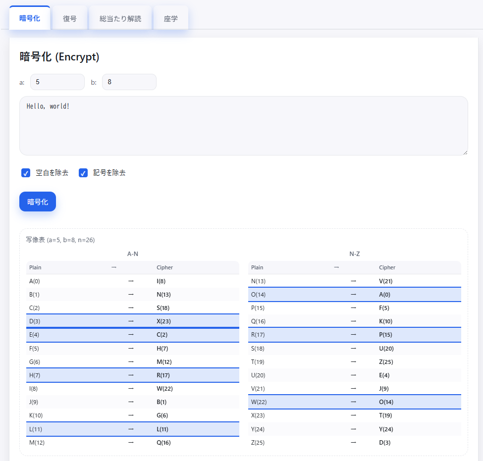

<!--
---
title: Affine CipherLab
category: classic-crypto
difficulty: 2
description: Visualize and practice affine cipher encryption, decryption, and mapping.
tags: [affine, cipher, cryptography, education]
demo: https://ipusiron.github.io/affine-cipherlab/
---
-->

# Affine CipherLab - アフィン暗号学習ツール


[](https://ipusiron.github.io/affine-cipherlab/)

**Day049 - 生成AIで作るセキュリティツール100**

**Affine CipherLab** は、古典暗号の一種であるアフィン暗号（Affine Cipher）を学習・体験できるWebツールです。  
暗号化・復号の基本操作に加えて、写像表を可視化することで直感的な理解をサポートします。  

本ツールは以下の4つのタブで構成されています：

1. **暗号化（Encrypt）** – テキストを暗号化し、変換過程をハイライト表示  
2. **復号（Decrypt）** – 逆元を用いた復号処理を確認  
3. **総当たり解読（Crack）** – `(a,b)` の全組み合わせ（312通り）を試行し候補を表示  
4. **座学（Learn）** – アフィン暗号の数式・直感的な解説・関連暗号との比較を掲載  

---

## 🌐 デモページ

👉 **[https://ipusiron.github.io/affine-cipherlab/](https://ipusiron.github.io/affine-cipherlab/)**

ブラウザーで直接お試しいただけます。

---

## 📸 スクリーンショット

>   
>
> *アフィン暗号での暗号化*

---

## 🛠 使い方

1. 上部入力欄でパラメーター`a`と`b`を設定  
   - `a`と26が互いに素でない場合はエラーが表示されます  
2. テキストを入力し、「暗号化」「復号」ボタンを押す  
3. 右側の写像パネルで変換対応を確認（表 / 帯グラフ / 円周表示の切替可）  
4. 総当たり解読タブで候補文を確認  
5. 座学タブで理論的背景を学習  

---

## 🧮 数学的背景

### 定義
アフィン暗号は以下で定義されます。

**暗号化:**
```
Enc(m) = (a × m + b) mod 26
```

**復号:**
```
Dec(c) = a⁻¹ × (c - b) mod 26
```

ここで：
- `m`: 平文の文字（0-25の数値）
- `c`: 暗号文の文字（0-25の数値）  
- `a`: 乗算鍵（1,3,5,7,9,11,15,17,19,21,23,25のいずれか）
- `b`: 加算鍵（0-25の任意の値）
- `a⁻¹`: aの逆元（a⁻¹ × a ≡ 1 (mod 26) を満たす値）

**重要:** aと26が互いに素（gcd(a,26)=1）である必要があります。

### なぜ「aとnの互いに素」が重要か

**gcd(a, 26) = 1 の場合（互いに素）:**
- 逆元 a⁻¹ が存在し、復号が可能
- 異なる平文は必ず異なる暗号文になる（一対一対応）
- 暗号化は可逆的

**gcd(a, 26) > 1 の場合（互いに素でない）:**
- 逆元 a⁻¹ が存在せず、復号が不可能
- 複数の平文が同じ暗号文に変換される場合がある
- 暗号文から元の平文を特定できない

26と互いに素な値は以下の**12個**：  
```
a ∈ {1, 3, 5, 7, 9, 11, 15, 17, 19, 21, 23, 25}
```

---

## 💡 直感的な理解

- `b` はシフト（平行移動）の役割  
- `a` は拡大縮小と折り返しの役割  
- `a=1` の場合、シフト暗号に一致
- `a=1, b=3` の場合、古典的なシーザー暗号に一致  

---

## 🔗 関連する古典暗号

### シフト暗号・シーザー暗号
- シフト暗号はアフィン暗号の特殊例  
  - `a=1`、`b=k`（kは任意のシフト量）  
  ```
  Enc(m) ≡ m + k (mod n)  (n=26)
  ```
- シーザー暗号はシフト暗号のさらに特殊例
  - `a=1`、`b=3`（シフト量3に固定）

### 多表式アフィン暗号（複数のアフィン暗号の組み合わせ）
このツールは単表式アフィン暗号を扱いますが、複数のアフィン暗号を組み合わせることで**多表式アフィン暗号**を構成できます：

```
位置1: Enc₁(m) = (a₁ × m + b₁) mod 26
位置2: Enc₂(m) = (a₂ × m + b₂) mod 26
位置3: Enc₃(m) = (a₃ × m + b₃) mod 26
...
位置k: Encₖ(m) = (aₖ × m + bₖ) mod 26
```

**特徴:**
- **周期性**: k個のアフィン暗号を順次適用し、k+1文字目で最初に戻る
- **セキュリティ向上**: 単表式より頻度分析に強い
- **鍵空間拡大**: 単表式の312通り → k個組み合わせで312^k通り

**実装例（周期2の場合）:**
```
平文: "HELLO WORLD"
位置: 12121 21212
暗号: 奇数位置は(a₁=5,b₁=8)、偶数位置は(a₂=3,b₂=15)で暗号化
```

### ヴィジュネル暗号との関係
アフィン暗号とヴィジュネル暗号は異なる暗号方式ですが、多表式という点で共通します：
- **単表式アフィン**: 全文字に同じ(a,b)を適用
- **多表式アフィン**: 位置に応じて異なる(aᵢ,bᵢ)を周期的に適用  
- **ヴィジュネル**: 位置に応じて異なるシフト量を周期的に適用（a=1固定のアフィン暗号の特殊形）

### 暗号の分類
- **単表式換字暗号**: シーザー暗号、単表式アフィン暗号
- **多表式換字暗号**: ヴィジュネル暗号、多表式アフィン暗号、プレイフェア暗号
- **転置暗号**: レールフェンス暗号、縦列転置暗号  

---

## 📝 具体例

### 一般的なアフィン暗号 (a=5, b=8)
```
a⁻¹ = 21 (mod 26)
Enc("HELLO") = "MJWWF"
Dec("MJWWF") = "HELLO"
```

### シーザー暗号 (a=1, b=3)
```
Enc("HELLO") = "KHOOR"
Dec("KHOOR") = "HELLO"
```

### ROT13 (a=1, b=13)
```
Enc("HELLO") = "URYYB"
Dec("URYYB") = "HELLO"
```

### 大文字小文字保持の例 (a=5, b=8)
```
Enc("Hello World!") = "Mjwwf Pfkwl!"
Enc("CRYPTOGRAPHY") = "SKTDMFXKTDVT"
Enc("Mixed-Case Text") = "Menzl-Saqz Mznm"
```
- 元の大文字・小文字・記号・空白がそのまま保持される
- アルファベット以外（数字・記号・空白）は変換されない

---

## 📁 ディレクトリー構成

```
affine-cipherlab/
├── index.html          # メインHTML（4タブレイアウト）
├── css/
│   └── style.css       # スタイルシート
├── js/
│   └── script.js       # メイン処理（暗号化・復号・総当たり解読）
├── assets/             # 画像・リソースフォルダー
├── CLAUDE.md           # AI開発時のプロジェクト情報
├── LICENSE             # MITライセンス
└── README.md           # このファイル
```

---

## 🔧 技術仕様

- **フロントエンド**: Vanilla JavaScript（ES6+）、CSS3、HTML5
- **アルゴリズム**: アフィン暗号、拡張ユークリッド互除法、カイ二乗検定
- **UI/UX**: レスポンシブデザイン、ダークモード自動対応
- **セキュリティ**: CSP設定、XSS対策、入力検証
- **ブラウザー対応**: モダンブラウザー（Chrome、Firefox、Safari、Edge）

## ✨ 主要機能

### 🔐 暗号化タブ
- **リアルタイム暗号化**: パラメーター(a,b)を設定してテキストを即座に暗号化
- **大文字小文字保持**: 元の文字の大小文字を保持（Hello → Mjwwf）
- **写像表表示**:「A-M」「N-Z」の2列レイアウトで文字変換を視覚化
- **入力オプション**: 空白除去・記号除去のチェックボックス（デフォルト無効）
- **文字ハイライト**: 処理された全文字が写像表で持続的ハイライト
- **コピー機能**: 暗号文を📋ボタンでクリップボードにコピー

### 🔓 復号タブ  
- **逆元計算**: 拡張ユークリッド互除法による自動逆元算出
- **大文字小文字保持**: 元の暗号文の大小文字を保持（Mjwwf → Hello）
- **同期機能**: 🔄ボタンで暗号化タブの結果とパラメーターを自動セット
- **写像表連動**: 暗号化タブと同じ写像表を共有表示
- **入力検証**: 無効なaパラメーターの警告表示
- **結果コピー**: 復号結果のワンクリックコピー

### 🔍 総当たり解読タブ
- **全鍵探索**: 312通り（「12個のa」×「26個のb」）の組み合わせを自動試行
- **英語判定**: 300語の英単語辞書 + 文字頻度分析による自動評価
- **表形式結果**: 順位・スコア・パラメーター・復号結果を表で整理表示
- **スコア詳細**: 英単語ヒット数・カイ二乗値・総合スコアを表示
- **写像確認**: 📊ボタンで候補パラメーターの写像表を即座に確認

### 📚 座学タブ
- **数学的定義**: 暗号化・復号の数式と変数説明
- **理論解説**: 互いに素の重要性・単射関数の説明
- **関連暗号**: シーザー暗号・シフト暗号・多表式アフィン暗号の関係
- **総当たり仕組み**: 解読アルゴリズムとスコア評価方法の解説
- **スコア説明**: score・hits・chiの意味と判読方法

### 🛡️ セキュリティ・UX機能
- **入力検証**: 日本語等の2バイト文字を自動検出・エラー表示
- **ボタン制御**: 無効入力時の自動ボタン無効化（視覚的グレーアウト）
- **パラメーター同期**: 全タブ間でa・bパラメーターを自動同期
- **エラー分離**: 入力エラーとパラメーターエラーを独立管理
- **トースト通知**: 操作完了・エラー発生時の非侵入的通知

### 🎨 UI/UXの特徴
- **ダークモード**: システム設定に応じた自動テーマ切り替え
- **レスポンシブ**: モバイル・タブレット・デスクトップ対応
- **アクセシビリティ**: キーボードナビゲーション・適切なコントラスト
- **統一デザイン**: 一貫したカラーパレットとコンポーネント設計
- **直感的操作**: アイコン付きボタン・明確なラベル・ツールチップ

---

## 📄 ライセンス

MIT License - 詳細は [LICENSE](LICENSE) をご覧ください。

---

## 🛠 このツールについて

本ツールは、「生成AIで作るセキュリティツール100」プロジェクトの一環として開発されました。  
このプロジェクトでは、AIの支援を活用しながら、セキュリティに関連するさまざまなツールを100日間にわたり制作・公開していく取り組みを行っています。

プロジェクトの詳細や他のツールについては、以下のページをご覧ください。  

🔗 [https://akademeia.info/?page_id=42163](https://akademeia.info/?page_id=42163)

