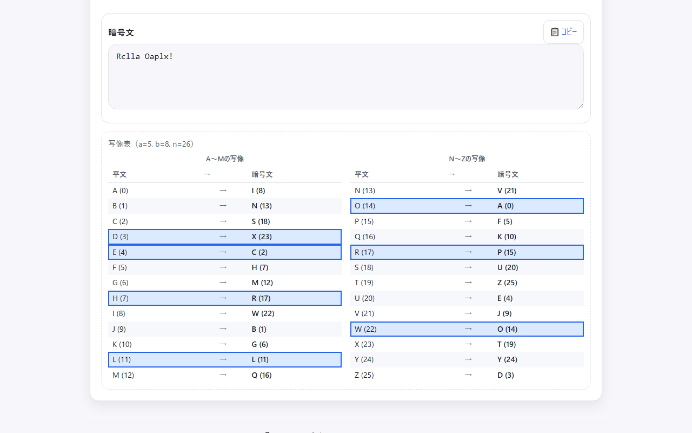
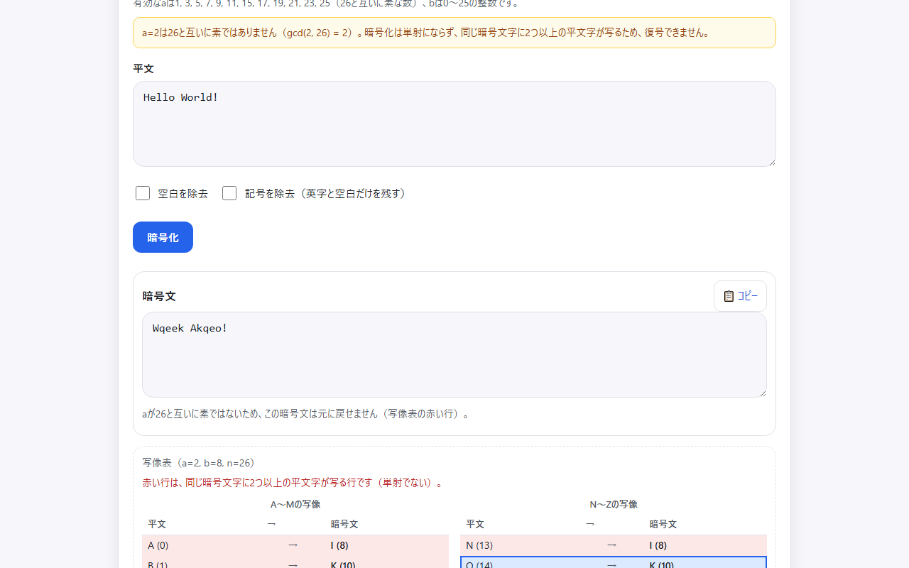
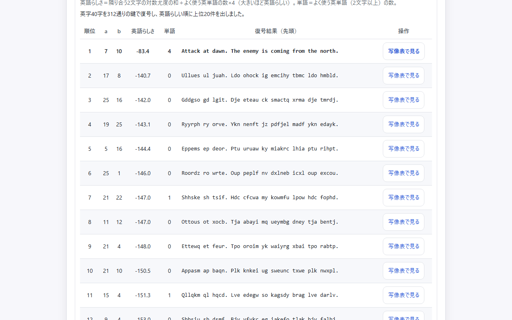
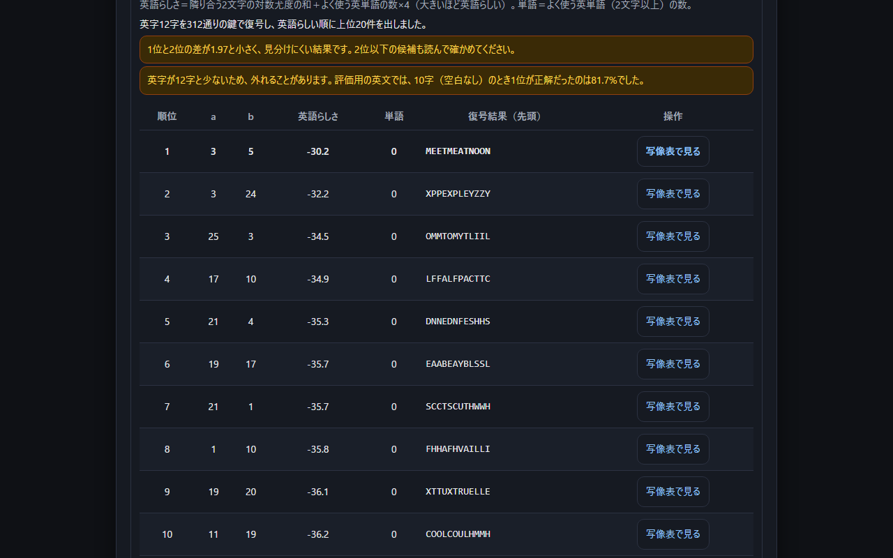

<!--
---
id: day049
slug: affine-cipherlab

title: "Affine CipherLab"

subtitle_ja: "アフィン暗号学習ツール"
subtitle_en: "Affine Cipher Learning Tool"

description_ja: "古典暗号「アフィン暗号」の暗号化・復号・総当たり解読を体験できる教育ツール。写像表の可視化により直感的な理解をサポート。"
description_en: "An educational tool for experiencing affine cipher encryption, decryption, and brute-force cracking. Supports intuitive understanding through mapping table visualization."

category_ja:
  - 古典暗号
category_en:
  - Classic Cryptography

difficulty: 2

tags:
  - affine-cipher
  - cryptography
  - encryption
  - decryption
  - brute-force
  - education
  - visualization

repo_url: "https://github.com/ipusiron/affine-cipherlab"
demo_url: "https://ipusiron.github.io/affine-cipherlab/"

hub: true
---
-->

[English](README.en.md) · 日本語

# Affine CipherLab - アフィン暗号学習ツール


[](https://ipusiron.github.io/affine-cipherlab/)

**Day049 - 生成AIで作るセキュリティツール100**

Affine CipherLabは、古典暗号の一種であるアフィン暗号（Affine Cipher）を学習・体験できるWebツールです。暗号化・復号に加えて、写像表で文字の対応を目で追え、312通りの鍵をすべて試す総当たり解読も体験できます。総当たりの採点は、隣り合う2文字の英語らしさに英単語の一致を足したもので、英字の数ごとに1位が正解になる割合を実測して載せています。

本ツールは4つのタブで構成しています。

1. 暗号化（Encrypt）: 平文を暗号化し、使った文字の行を写像表で強調する
2. 復号（Decrypt）: 逆元を使って暗号文を元に戻す
3. 総当たり解読（Crack）: 312通りの鍵をすべて試し、英語らしい順に候補を並べる
4. 座学（Learn）: 数式・逆元の求め方・特殊な場合・総当たりの仕組みを解説する

---

## 🌐 デモページ

👉 **[https://ipusiron.github.io/affine-cipherlab/](https://ipusiron.github.io/affine-cipherlab/)**

ブラウザーで直接お試しいただけます。

---

## 📸 スクリーンショット

>
>
>*Hello World!をa=5、b=8で暗号化し、使った文字の行を写像表で強調したところ*

>
>
>*a=2（26と互いに素でない）では、2つの平文字が同じ暗号文字に写り、復号できない*

>
>
>*英文の暗号文を312通りの鍵で試し、a=7、b=10の候補が1位に来たところ*

>
>
>*英字12字の暗号文。1位と2位の差が小さいことと、英字が少ないことを知らせる（ダーク）*

---

## ✨ 機能

### 🔐 暗号化

- a・bを入れて平文を暗号化する。英字（A〜Z・a〜z）だけを変換し、大文字・小文字を保つ
- 数字・記号・日本語など英字以外の文字はそのまま残す（カーリー引用符や全角の記号も受け付ける）。全角英字は変換せず、半角に直すよう知らせる
- 写像表（A〜MとN〜Zの2列）で、使った文字の行を強調する。入力中は最後に打った文字の行が一瞬光る
- aが26と互いに素でないときは警告し、暗号化はするが「元に戻せない」ことと、同じ暗号文字に写る行（赤）を見せる
- 「空白を除去」「記号を除去（英字と空白だけを残す）」、暗号文のコピー

### 🔓 復号

- 逆元a⁻¹を拡張ユークリッドの互除法で求めて復号する
- aが26と互いに素でないとき、整数でないとき、範囲の外のときは、理由を出して復号のボタンを止める
- 暗号化タブの暗号文と鍵を1回で入れるボタン。a・bは暗号化タブと復号タブで同じ値にそろう

### 🔍 総当たり解読

- 312通り（aの候補12個 × bの26通り）の鍵ですべて復号し、英語らしさの順に上位20件を出す
- 英語らしさは、隣り合う2文字の対数尤度の和に、よく使う英単語の数×4を足したもの（仕組みと正答率は下の節）
- 1位と2位の差が3未満なら「見分けにくい」と知らせる。英字が20字未満なら、評価用の英文で測ったその長さの正答率を添える
- 採点は先頭の英字2,000字までで行うので、長い暗号文でも待たずに終わる
- 候補の「写像表で見る」で、その鍵をa・bに入れる

### 📚 座学

- 定義、aと26が互いに素でなければならない理由、逆元の求め方（a=5の例）、特殊な場合（シーザー・ROT13・乗算暗号・アトバシュ）、総当たりの仕組み、関連ツール

### 🌐 画面

- 日本語・英語の切り替え（`?lang=ja`・`?lang=en`、選択は保存）、ライト・ダークの切り替え（OSの設定にも従う）
- タブは矢印キー・Home・Endでも移れる。警告と結果は読み上げにも伝わる（aria-live）
- index.htmlをファイルとして直接開いても動く（通常のスクリプトで作っている）

---

## 📖 使い方

1. 暗号化タブでa・bを入れる（有効なaは1, 3, 5, 7, 9, 11, 15, 17, 19, 21, 23, 25、bは0〜25）
2. 平文を入れて「暗号化」を押し、写像表で文字の対応を確かめる
3. 復号タブで「暗号化タブの暗号文と鍵を入れる」を押し、「復号」で元に戻ることを確かめる
4. 総当たり解読タブに暗号文を貼り、「解析する」で候補を見る。気になる候補は「写像表で見る」で鍵を入れる
5. 座学タブで、逆元や特殊な場合を確かめる

---

## 🧮 数学的背景

### 定義

英字をA=0, B=1, …, Z=25の数に置き換えて、次の式で変換します。

```
暗号化: Enc(m) = (a × m + b) mod 26
復号:   Dec(c) = a⁻¹ × (c − b) mod 26
```

- `m`は平文の文字、`c`は暗号文の文字（0〜25の数）
- `a`は乗算の鍵、`b`は加算の鍵（0〜25）
- `a⁻¹`はaの逆元（a⁻¹ × a ≡ 1 (mod 26)を満たす数）

### なぜaと26が互いに素でなければならないか

gcd(a, 26) = 1のときは、逆元a⁻¹があって復号でき、異なる平文字は必ず異なる暗号文字になります（一対一の対応）。gcd(a, 26) > 1のときは逆元がなく、複数の平文字が同じ暗号文字に写るので、暗号文から元の文字を決められません。たとえばa=2では、A（0）とN（13）がどちらも同じ文字に写ります（2 × 13 = 26 ≡ 0）。

26と互いに素なaは12個で、それぞれの逆元は次のとおりです。

| a | 1 | 3 | 5 | 7 | 9 | 11 | 15 | 17 | 19 | 21 | 23 | 25 |
|---|---|---|---|---|---|---|---|---|---|---|---|---|
| a⁻¹ | 1 | 9 | 21 | 15 | 3 | 19 | 7 | 23 | 11 | 5 | 17 | 25 |

### 逆元の求め方

拡張ユークリッドの互除法で、26 × s + a × t = 1となるtを探します。a=5なら、26 = 5 × 5 + 1なので1 = 26 × 1 + 5 × (−5)となり、a⁻¹ ≡ −5 ≡ 21です（5 × 21 = 105 = 26 × 4 + 1）。

---

## 💡 直感的な理解

- `b`はシフト（平行移動）の役割
- `a`は拡大と折り返しの役割（26で割った余りで一周する）
- `a=1`の場合はシフト暗号、`a=1, b=3`の場合はシーザー暗号に一致する

---

## 🔗 関連する古典暗号

### シフト暗号・シーザー暗号・アトバシュ・乗算暗号

- シフト暗号はa=1の特殊な場合（Enc(m) ≡ m + b (mod 26)）。シーザー暗号はb=3、ROT13はb=13
- 乗算暗号はb=0の特殊な場合（掛け算だけ）
- アトバシュ（A↔Z、B↔Y）はa=25、b=25の特殊な場合。25 ≡ −1なので、Enc(m) = 25 − mになる

### 多表式アフィン暗号

本ツールは単表式（すべての文字に同じa・b）のアフィン暗号を扱います。文字の位置ごとにa・bを変えると、多表式アフィン暗号になります。

```
位置1: Enc₁(m) = (a₁ × m + b₁) mod 26
位置2: Enc₂(m) = (a₂ × m + b₂) mod 26
...
位置k: Encₖ(m) = (aₖ × m + bₖ) mod 26
```

- k個の鍵を順に使い、k+1文字目で最初に戻る（周期k）
- 同じ平文字が位置によって別の文字になるので、単表式より頻度分析に強い
- 鍵の数は312ᵏ通りになる

### ヴィジュネル暗号との関係

ヴィジュネル暗号は、位置ごとにずらし方（b）だけを変えるもので、a=1に固定した多表式アフィン暗号にあたります。

### 暗号の分類

- 単表式換字暗号: シーザー暗号、アトバシュ、単表式アフィン暗号
- 多表式換字暗号: ヴィジュネル暗号、多表式アフィン暗号
- 多文字換字暗号（2文字ずつ置き換える）: プレイフェア暗号
- 転置暗号: レールフェンス暗号、縦列転置暗号

---

## 📝 具体例

画面と同じ計算の出力です（READMEの値はテストで実装と突き合わせています）。

| 平文 | a | b | 暗号文 | 補足 |
|---|---|---|---|---|
| HELLO | 5 | 8 | RCLLA | a⁻¹ = 21 |
| Hello World! | 5 | 8 | Rclla Oaplx! | 大文字・小文字と記号を保つ |
| CRYPTOGRAPHY | 5 | 8 | SPYFZAMPIFRY | |
| Mixed-Case Text | 5 | 8 | Qwtcx-Siuc Zctz | |
| HELLO | 1 | 3 | KHOOR | シーザー暗号 |
| HELLO | 1 | 13 | URYYB | ROT13 |
| HELLO | 25 | 25 | SVOOL | アトバシュ |
| HELLO | 3 | 0 | VMHHQ | 乗算暗号 |

---

## 🔬 総当たり解読の仕組みと正答率

1. 312通りの鍵で暗号文を復号する（採点は先頭の英字2,000字まで）
2. 復号した文の英語らしさを点数にする。隣り合う2文字の組の対数尤度（『高慢と偏見』の英字約16万字から作った表）の和に、よく使う英単語（2文字以上、275語）の数×4を足す
3. 点数の高い順に並べる。1位と2位の差が3未満なら「見分けにくい」と知らせる

単語の重み（×4）と差の境目（3）は、学習用の英文（『高慢と偏見』）で決めました。学習用の英文では、差が3以上のときに1位が正解だったのは99.3%、3未満では56.2%でした。

評価用の英文（『二都物語』、学習用とは別の作品）から切り出した平文を、決まった種の乱数で選んだ鍵で暗号化し、総当たりの1位が元の平文に戻った割合です（各300回）。

| 英字の数 | 単語の空白あり | 空白なし |
|---|---|---|
| 6 | 67.0% | 46.0% |
| 8 | 81.0% | 68.3% |
| 10 | 88.7% | 81.7% |
| 15 | 98.3% | 95.3% |
| 20 | 100.0% | 98.3% |
| 30 | 100.0% | 100.0% |

- 空白のない暗号文では、単語の一致を数えられないので、隣り合う2文字だけで選ぶことになる
- 英字が10字前後までは外れることがある。候補の上位を読み比べて確かめる
- 表の値は`node tools/evaluate.mjs eval`で再現できる

---

## 🎯 ユースケース

- 授業・勉強会: 互いに素の意味、逆元、単射でない写像を、写像表で目に見える形で示す
- 謎解き・パズル: アフィン暗号らしい暗号文を総当たりにかけ、候補を読み比べる
- CTFの練習: 古典暗号の問題で、鍵の候補が312通りしかないことを確かめる
- プログラミングの学習: 拡張ユークリッドの互除法、対応表による変換、言語モデルによる採点、決まった種での評価を小さなコードで読む
- 暗号の教材づくり: 具体例や正答率の表を、テストで実装と突き合わせた値として引用する

---

## 🔒 セキュリティとプライバシー

- 入力した文字は、ブラウザーの中だけで処理し、外部へ送信しません
- Content Security Policy（meta）で、スクリプト・スタイルを同じ場所のファイルだけに限り、インラインのスクリプト・スタイルを許していません。外部への通信も許していません
- 入力された文字列や結果は`textContent`でだけ表示します（HTMLとして解釈しません）
- ブラウザーに保存するのは、言語とテーマの選択だけです。保存できない環境でも動きます
- 外部リンクには`rel="noopener noreferrer"`を付け、リファラーを送りません

---

## ⚠️ 注意と限界

- アフィン暗号は学習用の古典暗号で、秘密を守る用途には使えません（鍵は312通りしかなく、すぐに総当たりできる）
- 総当たりの採点は英語の平文を前提にしています。英語以外の平文では当てになりません
- 英字が少ない暗号文では1位が外れることがあります（上の表）
- 対象はA〜Zの26文字です。全角英字やアクセント付きの文字（éなど）は変換しません
- 入力は10万字までです

---

## 🧪 テスト

```bash
npm test
```

- Node.js 22以上の標準のテストランナー（`node:test`）で動き、依存パッケージはありません。GitHub Actionsで、pushとpull requestのたびに自動で実行します
- 既知解答はPython（`pow(a, -1, 26)`、別に書いた暗号化、拡張ユークリッドの互除法）で計算した値です
- 暗号化・復号・逆元・鍵の入力の検査、写像表、総当たりの順位と「見分けにくい」の判定、採点の表が生成スクリプトの出力と一致すること、英文の抜粋が作ったときのままであること
- index.htmlのCSP・ARIA・ラベル、日英の辞書、配色のコントラスト（ライト・ダークとも4.5:1以上）、行の長さ
- READMEの具体例・逆元の表・正答率の表・ディレクトリー構造（日英）も、実装と突き合わせて検証します

---

## 📁 ディレクトリー構造

```
affine-cipherlab/
├── .github/                      # GitHubの設定
│   └── workflows/                # GitHub Actions
│       └── test.yml              # pushとpull requestでnpm testを実行
├── assets/                       # README用の画像
│   ├── en/                       # 英語版README用のスクリーンショット
│   │   ├── screenshot.png        # 暗号化と写像表
│   │   ├── screenshot2.png       # 単射にならない例
│   │   ├── screenshot3.png       # 総当たり解読
│   │   └── screenshot4.png       # 見分けにくい短い暗号文
│   ├── screenshot.png            # 暗号化と写像表
│   ├── screenshot2.png           # 単射にならない例
│   ├── screenshot3.png           # 総当たり解読
│   └── screenshot4.png           # 見分けにくい短い暗号文
├── css/                          # スタイル
│   └── style.css                 # 画面のスタイル（ライト・ダークの配色）
├── js/                           # 画面のスクリプト（通常のスクリプト、file://でも動く）
│   ├── accuracy.js               # 長さ別の正答率（tools/evaluate.mjsの生成物）
│   ├── affine-core.js            # 計算部（暗号化・復号・逆元・総当たり）
│   ├── english-data.js           # 隣り合う2文字の表（tools/build-english.mjsの生成物）
│   ├── i18n.js                   # 言語の選択と静的な文言の差し替え
│   ├── messages.js               # 日本語・英語の文言
│   ├── script.js                 # 画面の処理
│   ├── theme-init.js             # 描画の前にテーマを当てる
│   └── theme.js                  # ライト・ダークの切り替え
├── test/                         # node:testのテスト
│   ├── contrast.test.js          # 配色のコントラスト
│   ├── core.test.js              # 暗号化・復号・逆元・入力の検査（既知解答）
│   ├── crack.test.js             # 総当たり・採点の表・英文の抜粋
│   ├── format.test.js            # 行の長さ・改行コード
│   ├── html.test.js              # CSP・ARIA・ラベル・辞書との一致
│   ├── i18n.test.js              # 言語の選択
│   ├── load.js                   # 通常のスクリプトをテストに読み込む
│   ├── messages.test.js          # 日英の辞書
│   ├── readme.test.js            # READMEの表・ツリー・画像
│   └── solve.test.js             # 既知の2組から鍵を解く・頻度による仮定・URLの受け取り
├── tools/                        # 開発用のスクリプト（画面では使わない）
│   ├── corpus/                   # 英文の抜粋（Project Gutenberg）
│   │   ├── eval-pg98.txt         # 評価用: A Tale of Two Cities（#98）
│   │   └── train-pg1342.txt      # 学習用: Pride and Prejudice（#1342）
│   ├── build-english.mjs         # 隣り合う2文字の表を作る
│   ├── evaluate.mjs              # 正答率を測る・重みを選ぶ・accuracy.jsを書く
│   ├── load-core.mjs             # 計算部を開発用スクリプトに読み込む
│   └── make-corpus.mjs           # Gutenbergのテキストから抜粋を作る
├── .gitignore                    # Gitの管理から外すファイル
├── .nojekyll                     # GitHub PagesでJekyllを使わない指定
├── CLAUDE.md                     # 開発の手引き（Claude Code用）
├── LICENSE                       # MITライセンス
├── README.en.md                  # 英語版のREADME
├── README.md                     # 本ドキュメント
├── index.html                    # 画面
└── package.json                  # npm testの設定
```

---

## 💻 動作環境

- Chrome・Edge・Firefoxの最新版で確認しています
- index.htmlをファイルとして直接開いても動きます。テストにはNode.js 22以上が必要です

---

## 📄 ライセンス

- ソースコードのライセンスは`LICENSE`ファイルを参照してください。
- 採点の表づくりと評価に使う英文の抜粋（`tools/corpus/`）は、Project Gutenbergの電子テキスト（#1342 Pride and Prejudice、#98 A Tale of Two Cities）の本文を大文字にし、英字以外を空白にそろえたものです。どちらも米国でパブリックドメインです。

---

## 🛠️ このツールについて

本ツールは、「生成AIで作るセキュリティツール100」プロジェクトの一環として開発されました。
このプロジェクトでは、AIの支援を活用しながら、セキュリティに関連するさまざまなツールを100日間にわたり制作・公開していく取り組みを行っています。

プロジェクトの詳細や他のツールについては、以下のページをご覧ください。

🔗 [https://akademeia.info/?page_id=42163](https://akademeia.info/?page_id=42163)
